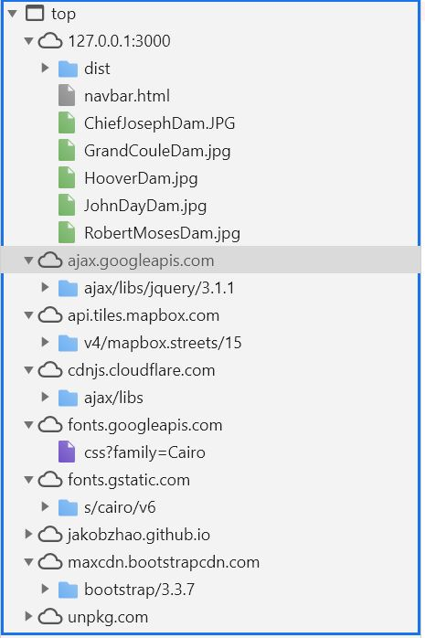
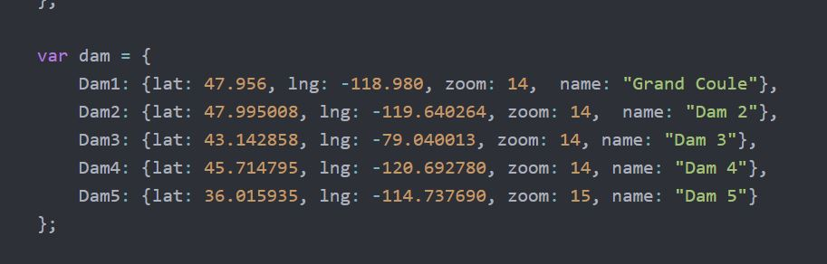
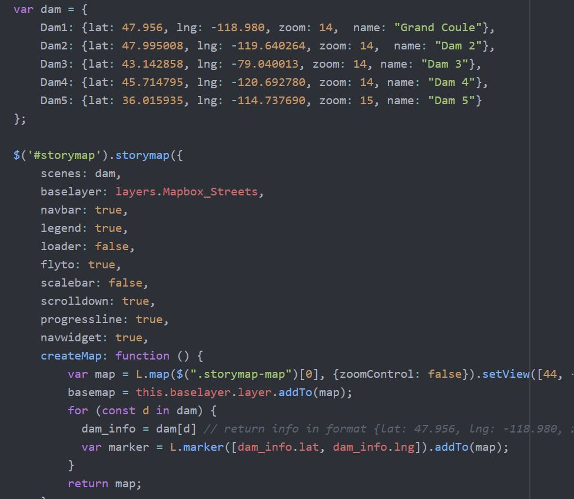

Alex Zhen
May 20th, 2020
Geography 458 Final Essay

<h1>My Story Map: Hydroelectricity Generation</h1>

The goal of this project was creating a story map about hydroelectric power generators in the United States. This story map contains that five top producing hydroelectric generators in the US. It is currently extremely important right now as climate change is impacting many lives, ecosystems and countries from flooding, shortage of goods, marine species, diets and shelter displacement. There are so many hydroelectric generators in the United States, but we do not talk about it and this poses a problem with renewable energy but there are also many side effects of hydroelectric which I will briefly mention. Lots of advertisement and resources are going into wind and solar energy but the land that it takes to create sustainable sources is nowhere near enough when it comes to efficiency. While United States highly depends on fossil fuels for electricity this comes at a planetary cost. The cost of degradation is far greater than benefits and that has been scientifically proven. As hydroelectricity produces more than 60% of the electricity in Washington State, many other states do not have this luxury because it is either not feasible because of cost or the geographic location does not allow but there are many other states that have rivers where it is a viable energy source. It is important to think about multiple energy sources working together rather than relying on one or two. While hydroelectric and other renewable energy is proving that it can be administered and much more sustainable than using fossil fuels it still comes at a cost.

The cost of creating renewable energy using hydroelectric is nowhere as harmful as using fossil fuels as they produce much more carbon dioxide in the atmosphere. We have seen many ecosystems vital to many species being affected. While the planetary cost of fossil fuel is disastrous, renewable energy also has its problems such as contamination, but it is much cleaner. Currently, hydroelectricity is one of the most efficient power generating sources. The Grand Coulee Dam located in Washington State which produces power to more than 75% in the Pacific Northwest (USBR). Having such sustainable sources to create electricity is a magnificent technology for mankind but hydroelectricity has this problem of decreasing critical species population. Many electric dams are in areas where they block critically endangered population from their spawning grounds such as salmon and trout. This has been a major problem but current projects are now fixing and creating dams with fish passages so species like these can spawn which is critical for the economy,  people who rely on aquatic species for survival and other high revenue recreation activities.

The major functions of my story map are the interactive scrolling it has; every time the user scrolls, it will be got to specific place in the map of the hydroelectric dam. When you enter the website, you will end up at the first hydroelectric dam which generates the most power then as you scroll down it will introduce the second place, third place etc. until the fifth place. The other major the functions that the story map is a legend (information box). The information box will appear every time when you scroll and will automatically go to the description of the dam. The legend includes a picture of the dam, a picture, descriptions, and some statistics about it (Appendix Figure 1). The targeted audience are people interested in learning about hydroelectricity. It is a quite simple yet descriptive map of each dam. The information is not too dense which makes it easily readable and understandable. I created this map so it would look simple for the eye but easy for anyone who is interested in learning about the pros and cons on dams as it can be very an alternative to fossil fuels. The author who created this map is Alex Zhen which is me. I am a geography student that goes to the University of Washington and this is the final project for my Geography 458 class. As a graduating senior, I am focusing on using GIS for terrestrial/marine conservation on endangered species. A story map to me is much more interactive and appealing to any user versus looking at an ordinary map. Using a story map for me personally, I feel is a much better way of showing data not just with numbers.

The system architecture of this story map is created with the client, server, services, and data for my website to be available. My computer will send a request to a web server in this case which is my web browser client requesting to the web server so it can retrieve and display my story map on my computer. Since I am using GitHub, I am requesting that to access this page which GitHub web service will respond back by displaying the browser page on our computer. GitHub for example of what I am using is also a geospatial web service that specializes in drawing, processing, and responding to GIS analysis operations. The services provided by the geo-server will show our web maps to the world using the world wide web (www). Web services that I did on this story map consist of giving specific locations on base map, making it interactive by putting pictures and many other functions and analysis that can be done such as showing statistics, quantifying data, showing correlations/pattern (UW HGIS – COVID 19) interactive maps etc.

The data of my story map is sourced and inputted into my JavaScript code with specific X & Y coordinates from places where there are the dams (Appendix Figure 3). In this class, we learned how to link a CSV, KML file etc. in our code to our story maps, create geoJSONs through QGIS but I decided that it was not necessary to create a geoJSON layer since there are less than six points. I would say if there were more data points, I would use a geoJSON layer so the map tile would have all the coordinates, so I do not have manually type it in or else it will get complicated.

The data flowed in between the client and server consist of processes and queued as seen in the data flow. This is because the client is trying to reach the server and there is stall time in between them as the server responds. The major libraries I used in my web map would be the JQuery Library which was the styling for the front-end fonts and symbols. Another library I decided to use was map box because I used the base map. This is the base map that is seen when you are on the page scrolling around. The library includes many maps that can be used but I decided that the map box street view is the most suitable and simple in representing hydrology and dams without too much background distractions. I also used the CSS library to change different font sizes. CSS is to style the page and I used it to style and change the font size and fonts to something that would be bigger and simpler to read. This function can be seen in the information box on the left of the page consisting of the title to the descriptions. Another library I decided to use was bootstrap because I thought it had some good layout and templates already. I decided to build on from this library and including some of the templates and styles from the professor’s library as seen when you inspect element for sources. Lastly, I did include the Cloudflare library where I could introduce the points in the code (Appendix Figure 2). This is seen as the markers for the dam in each location.

This project supports responsive design because it will adjust to user’s behavior when it comes to whatever platform they are using. The project will enlarge or decrease in size depending on the size of the screen. An example of this is making the window smaller for the website and it will automatically scale according to the ‘behavior’ of the user.

- Data Sources(list)
o	Map Box Open Street Map (Tile Layer)
o	Dam Locations

Since this a template there is UI/UX web mapping design. The user interface of this website is friendly and simplistic but there are a lot of moving variables. When you hover your mouse not on all the scroll bar and onto the map directly itself, it will zoom in and out confusing the user. This is somewhat of a bad design as if there were more data points much further apart from each other it can get really confusing. According to Song interactivity control and interface can lead to different influences of retention, comprehension, and preferences for users. Having interactive web mapping experience can improve the readers ability to understand the story better. To acquire good storytelling technique, I used Songs research to include interactivity for user experience.

The base map is the layer that represents the referencing of locations (geolocations) for these dams. This will upgrade the user’s interactivity in knowing where these dams are located such as which states, cities, and the country. Some interactive feature that this map has is when the user is scrolling, blue markers and an information bar for each of the five dams in the story map (appendix figure 4). If the user wants to use the navigation bar on the top of the page instead of scrolling that can be done too.

Some strengths of this project is that it gives a good idea of the dam’s location, descriptions of it, a picture where the user can visualize and a moving map which will automatically go to that area. These strengths make it so that user can easily view wherever they want by scrolling without having to worry about the location of the dam being wrong. The map is also very simple, so it makes it very easy to see the surrounding areas. A weakness I would say in this map is that I feel that the interactivity can be upgraded with other abilities such as blue markers popping up some text when I would hover my mouse over it. I could not get this function to work, I am not sure why because it would break my web page. Another weakness of this project is that it has tendency to tell the user whether hydroelectricity is good depending on how they depict the description in the information bar. I also feel like adding more hydropower plants in the United States would be a great idea for this project so other users can understand the scale of the energy needs in the US.

<h3>Social Theories</h3>

This project in my opinion does reflect data journalism which is the process of collecting and analyzing data to form visualizations for key insights (Song, 2017). I would say even though my project doesn’t directly deal with data in a sense where there are correlations/patterns that can be visualized between specific data topics, we can relate this data journalism to my project as a form of descriptive data instead statistical. In this project I am actively shaping an explanation, because of the information in the information box by characterizing this theme as climate issues (Weber & Rall, 2012; Rogers, 2014). There can be many themes associated in a cartographic map such as politics, disaster, environment, and science etc. This map is interesting when it comes to how many social themes it can relate to. Another theme I would like to mention is the information divide. Kitchin argues that there is a long history of cities generating data to create information for the control of the urban environment. This will guide public policies to something more particularly in favor of the government. In my project, I am not creating data, but I feel like the data information I used to hopefully spread knowledge can also have a negative impact when it comes to understanding benefits and impacts. Even though my project is nowhere as valid and accurate compared to the hydro plant operators where data is updated every second, lots of the data that I used was created by city planners to guide the knowledge of hydroelectricity and the reaping benefits that it has. Nowhere when I was researching on the government’s website talk about the environmental impacts of aquatic species. This poses a valid point of what Kitchin argues that the city only wants you to see a one-sided aspect similarly to the Dublin dashboard. 

<h6>References</h6>

Grand Coulee Dam | Bureau of Reclamation. (May 19th, 2020). Retrieved May 19, 2020, from https://www.usbr.gov/pn/grandcoulee/

Kitchin, R., Maalsen, S., & McArdle, G. (2016). The praxis and politics of building urban dashboards. Geoforum, 77, 93–101. https://doi.org/10.1016/j.geoforum.2016.10.006

Song, Z., author. (2017). Map-based visual storytelling: An assessment of emerging genres and tropes [2017.]. https://search.library.wisc.edu/catalog/9912365563802121

Weber, W., & Rall, H. (2012, July). Data visualization in online journalism and its implications
for the production process. In Information Visualisation (IV), 2012 16th International
Conference on (pp. 349-356). IEEE.

<h6> Appendix </h6>

 Figure 1(Above) 

 Figure 2(Above) 

 Figure 3(Above) 

 Figure 4 (Above) 
